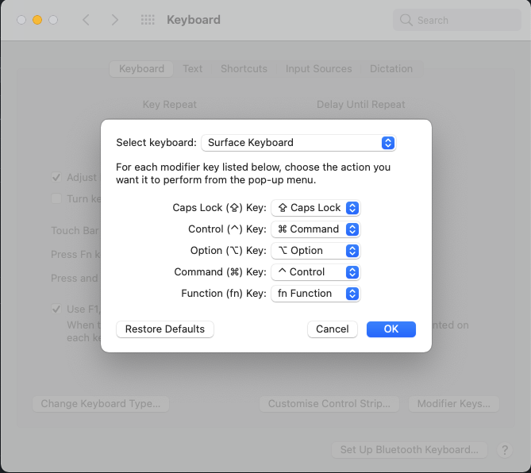
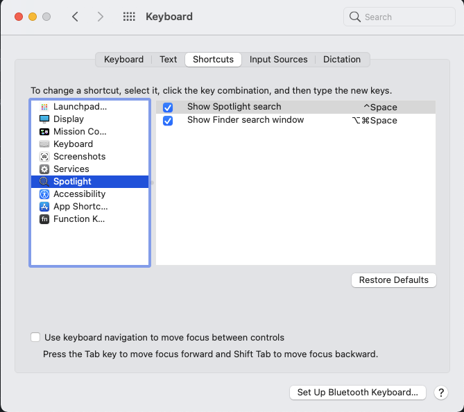
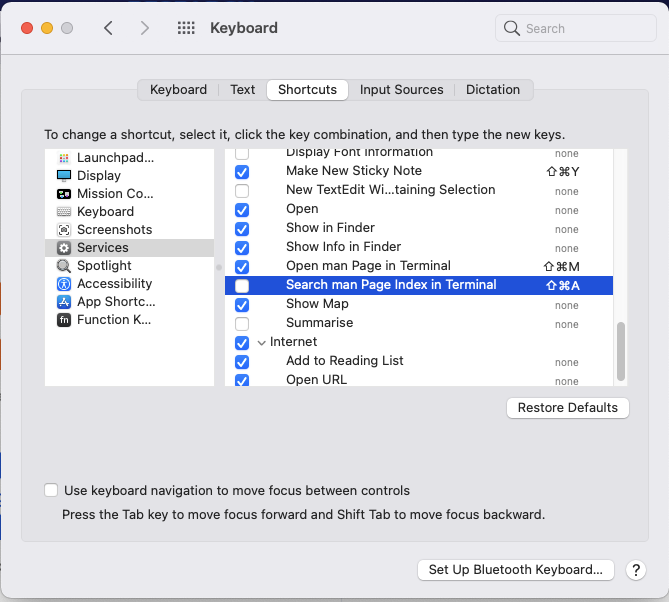
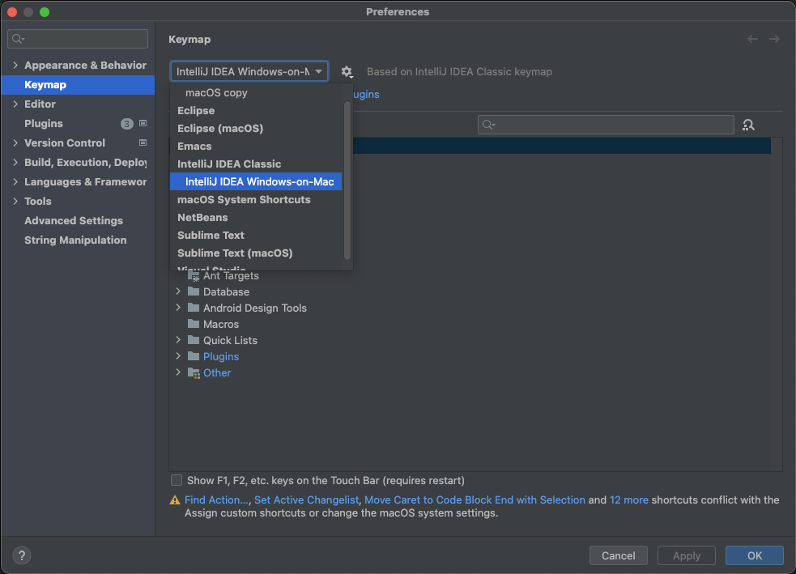

# Windows keymap on MacOS (when using Windows/Linux compatible keyboard)
Changes MacOS Intellij IDEA shortcuts to be similar to Windows/Linux.
###### Important note: overriding "Preferences" shortcut doesn't work. 
###### In the XML it's changed to `Command+Shift-Alt-S` but it's still `Command + ,`.

---

## 1. Pre required MacOS settings:
####- Go to System Preferences -> Keyboard -> Keyboard (Tab) -> Modifier Keys
####- Follow settings below:

####- Change Spotlight shortcut to Windows+Space:

####- Disable Command-Shift-A shortcut:


---

## 2. Configuration:
#### Put the keymap XML file `IntelliJ IDEA Windows-on-Mac.xml` to the directory on your MacOS system:
```
Syntax
~/Library/Application Support/JetBrains/<product><version>/keymaps
```
```
Example
~/Library/Application Support/JetBrains/IntelliJIdea2021.3/keymaps
```

#### Restart IDE. Keymap should appear in Preferences -> Keymap -> (dropdown):

